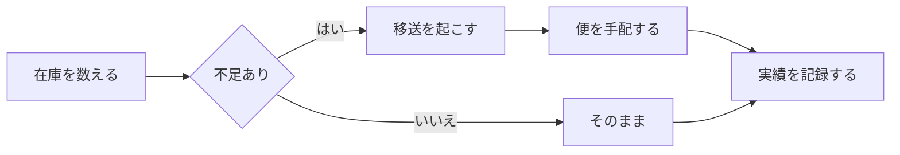

# v2.0.1 の目視確認用

この文書は、**スクロールバー・タッチパッド・ファイル選択**を確かめるために
作ってある。中身の意味はどうでもよく、次の 3 つを満たすことだけが目的である。

- 縦に長い（縦のバーが出る）
- **折り返さない長い行がある**（横のバーが出る）
- 図がある（描き直しの様子が見える）

---

## 1. 横に長い行（横のバーを出す）

次の行は折り返さない。右端まで行くと横のスクロールバーが出るはずである。

    拠点コード=TYO-001 / 担当=物流第一課 / 週便数=12 / 夜間便=あり / 備考=年末年始は臨時便を追加する / 更新者=運用担当 / 更新日=2026-10-06 / 承認=済 / 連絡先=内線1234 / 次回見直し=2027-01-05 / 備考2=天候不良時は前日までに連絡する

```
SELECT 拠点, 担当, 週便数, 夜間便, 備考 FROM 移送計画 WHERE 年度 = 2026 AND 四半期 IN (1, 2, 3, 4) ORDER BY 拠点 ASC, 週便数 DESC, 担当 ASC, 更新日 DESC, 承認 ASC;
```

## 2. 図（編集して点滅しないことを見る）



**この図のラベルを 1 文字ずつ書き換えてみる。** 打つたびに図が消えたり
構文エラーの図が出たりせず、打ち終わって少し待ってから描き直るのが正しい。

## 3. 数式

$$
k = \left\lceil \frac{n}{c} \right\rceil
$$

---

## 4. 縦に長くするための本文

以下は縦のバーを出すための埋め草である。読む必要はない。

### 4.1 節

東京の在庫を数える。大阪の在庫を数える。福岡の在庫を数える。
不足している品目を洗い出す。便の空きを確かめる。移送を起こす。

### 4.2 節

東京の在庫を数える。大阪の在庫を数える。福岡の在庫を数える。
不足している品目を洗い出す。便の空きを確かめる。移送を起こす。

### 4.3 節

東京の在庫を数える。大阪の在庫を数える。福岡の在庫を数える。
不足している品目を洗い出す。便の空きを確かめる。移送を起こす。

### 4.4 節

東京の在庫を数える。大阪の在庫を数える。福岡の在庫を数える。
不足している品目を洗い出す。便の空きを確かめる。移送を起こす。

### 4.5 節

東京の在庫を数える。大阪の在庫を数える。福岡の在庫を数える。
不足している品目を洗い出す。便の空きを確かめる。移送を起こす。

### 4.6 節

東京の在庫を数える。大阪の在庫を数える。福岡の在庫を数える。
不足している品目を洗い出す。便の空きを確かめる。移送を起こす。

### 4.7 節

東京の在庫を数える。大阪の在庫を数える。福岡の在庫を数える。
不足している品目を洗い出す。便の空きを確かめる。移送を起こす。

### 4.8 節

東京の在庫を数える。大阪の在庫を数える。福岡の在庫を数える。
不足している品目を洗い出す。便の空きを確かめる。移送を起こす。

### 4.9 節

東京の在庫を数える。大阪の在庫を数える。福岡の在庫を数える。
不足している品目を洗い出す。便の空きを確かめる。移送を起こす。

### 4.10 節

東京の在庫を数える。大阪の在庫を数える。福岡の在庫を数える。
不足している品目を洗い出す。便の空きを確かめる。移送を起こす。

### 4.11 節

東京の在庫を数える。大阪の在庫を数える。福岡の在庫を数える。
不足している品目を洗い出す。便の空きを確かめる。移送を起こす。

### 4.12 節

東京の在庫を数える。大阪の在庫を数える。福岡の在庫を数える。
不足している品目を洗い出す。便の空きを確かめる。移送を起こす。

### 4.13 節

東京の在庫を数える。大阪の在庫を数える。福岡の在庫を数える。
不足している品目を洗い出す。便の空きを確かめる。移送を起こす。

### 4.14 節

東京の在庫を数える。大阪の在庫を数える。福岡の在庫を数える。
不足している品目を洗い出す。便の空きを確かめる。移送を起こす。

### 4.15 節

ここが末尾。**縦のバーのつまみが下端に着いている**はずである。
