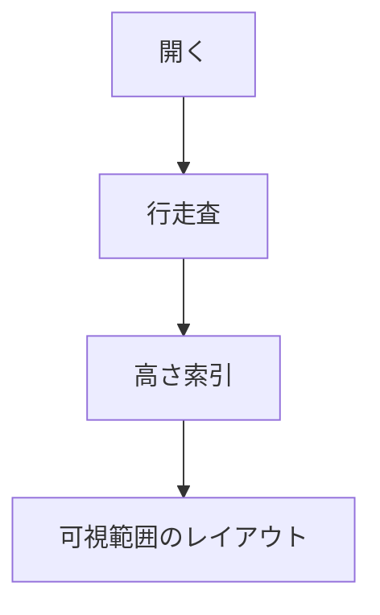
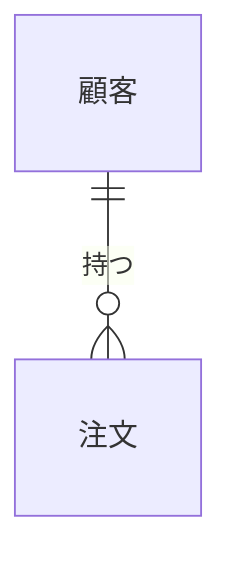

# P3 の目視確認用

この文書は **P3（埋め込み）の見た目を目で確かめる**ためのものである。
自動試験では確かめられないもの——字形・色・行間——だけを集めてある。

確認手順は [samples/README.md](README.md) を参照する。

## 1. 日本語の字形（DEC-208）

漢字統合の事故が戻っていないかを見る。**中国語の字形になっていないこと。**

> 入力、直接、今日、社会、対応、真実、海辺、告白、次回、強力

上の行が**日本語の字形**であること。とくに「入」「直」「今」「対」「真」は
中国語フォントだと形がはっきり違う。

エディタ（左）とプレビュー（右）で**同じ字形**であること。

## 2. インライン要素（§12.7）

**太字**と*強調*と `インラインコード` と [リンク](https://example.com) を混ぜる。

- 記法（`**` や `[]()`）が**画面に出ていない**こと
- リンクは URL ではなく**本文だけ**が出ていること
- 強調が本文と区別できること

1. 番号つきの項目
2. 二つ目
3. 三つ目

> 引用は左に縦線が付き、1 段字下げされる。
> 引用の中でも **太字** が効く。

## 3. コードブロックの着色（DEC-211）

### Rust

```rust
/// ドキュメントコメント
fn main() {
    let name = "日本語の文字列";
    let count: u32 = 42;
    if count > 0 {
        println!("{name} を {count} 回", name = name, count = count);
    }
}
```

### Python

```python
# コメント
def greet(name: str) -> str:
    """説明文"""
    return f"こんにちは、{name}さん"

if __name__ == "__main__":
    print(greet("世界"))
```

### bash

```bash
#!/usr/bin/env bash
# ビルドして試験を回す
set -euo pipefail
cargo build --release && cargo test
echo "終わった"
```

### JSON

```json
{
  "name": "markdown-viewer",
  "version": "2.0.0",
  "enabled": true,
  "count": 128
}
```

### 言語名なし（着色されないのが正しい）

```
これは素のまま出る。
**太字** も記法のまま残る。
```

### text（意図して着色しない）

```text
ここも素のまま。
```

確認すること。

- キーワード・文字列・コメント・数値が**互いに違う色**であること
- 色が**読みにくくない**こと（背景に溶けていない、塗りすぎでない）
- ``` の行が**画面に出ていない**こと
- 言語名なしと `text` は**着色されない**こと（これは正しい挙動）

## 3.5 埋め込み（図・数式）のプレースホルダ（§16.5）

図（Mermaid）と数式（LaTeX）が実際に描かれること。



```math
\int_0^\infty e^{-x^2}dx = \frac{\sqrt{\pi}}{2}
```

```math
\begin{pmatrix} a & b \\ c & d \end{pmatrix}
```

**数式の中に日本語は書けない**（OPEN-211）。次は理由が読める形で失敗するのが正しい。

```math
\text{面積} = \pi r^2
```

erDiagram は**図にせず原文を出す**のが正しい（OPEN-210。ラベルが欠けるため）。



確認すること。

- 図のラベル（「開く」「行走査」など）が**読める**こと
- 数式が**組まれて**いること。2 行 2 列の行列が 1 行に潰れていないこと
- `\text{面積}` は**理由が分かる文言**で失敗していること（黙って空白でないこと）
- erDiagram は図ではなく**原文**が出ていること
- ここでウィンドウが固まらないこと（描画はワーカーで行う）

## 3.6 画像（§16.12）

段落全体が画像 1 つのときは、画像として表示する。パスは**この文書の位置**を
基準に解決する。


**ネットワークからは取得しない。** 次は画像にならず、
**取得しないことを述べた文**が出るのが正しい。


無いファイルは、**どのファイルが無いのか**が読める形で失敗する。


文章の途中にある画像は、画像としては描かず、
**`［画像: 説明］` という文字に置き換える**（DD-OPEN-13）。
行の中に画像の箱を置く仕組みが要るためで、いまは入っていない。

これは  を文中に置いた例である。

確認すること。

- 1 つ目の画像が**表示されている**こと（600x200 の青い帯。幅に合わせて縮む）
- 外部の画像は「外部の画像は取得しません: https://…」と**文で**出ていること
  （空白になっていないこと）
- 無いファイルは**パスが読める**形で失敗していること
- 文中の画像が `［画像: 小さな図］` という文字になっていること

## 3.7 チェックリスト（受入条件 §23.1）

- [ ] まだ終わっていない項目
- [x] 終わった項目
- [X] 大文字でも終わり
- ふつうの項目（箱にならない）

確認すること。

- `[ ]` と `[x]` が**箱**（☐ / ☑）になっていること
- 記法の `[ ]` が本文に残っていないこと
- ふつうのリストは `•` のままであること

## 4. 表の列幅（§3.3）

|項目|短い|とても長い内容が入る列で折り返しの具合を見る|右寄せ|
|---|:---:|---|---:|
|1|あ|日本語の長い文章をセルに入れて、列幅の配分と折り返しが妥当かを見る|1,234|
|2|いい|短い|56|
|3|う|`コード` と **太字** をセルの中に入れる|7|

確認すること。

- 見出し行が**太字**であること
- 行ごとに**罫線**が引かれていること
- 中央寄せ・右寄せが効いていること
- 列が重なっていないこと

## 5. 長い行の折り返しと禁則（§3.2）

日本語の長い段落で、行頭に読点や句点が来ていないことを確かめる。これは、ウィンドウの幅を変えながら見ると分かりやすい。「かぎ括弧」や（丸括弧）が行末・行頭で不自然に切れていないこと。英数字の長い語（supercalifragilisticexpialidocious）や URL（https://example.com/very/long/path/that/keeps/going）が幅を超えたときに、文字単位で折り返されること。

## 6. 見出しの大きさ

# 見出し 1
## 見出し 2
### 見出し 3
#### 見出し 4

`#` が画面に出ておらず、階層が大きさで分かること。
