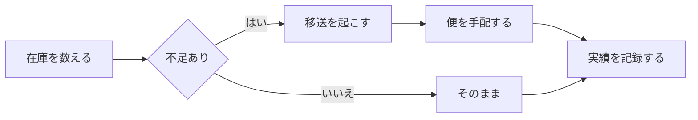

# 四半期の在庫移送計画

業務の 3 拠点（東京・大阪・福岡）をまたぐ在庫の移送を、
**週次で見直す**ための手順をまとめる。

## 対象と担当

|拠点|担当|週あたりの便数|備考|
|---|---|---|---|
|東京|物流第一課|12|夜間便を含む|
|大阪|物流第二課|8|祝日は運休|
|福岡|委託（T 社）|5|**要事前連絡**|

## 週次の流れ



## 手順

1. 月曜の朝に各拠点の在庫を数える
2. 不足している品目を洗い出す
3. 便の空きを確かめてから移送を起こす

- [x] 数え方の手引きを配る
- [x] 便の時刻表を貼り出す
- [ ] 実績の記録を自動で集める

## 必要な便数の見積もり

1 便あたりの積載を $c$、不足数を $n$ とすると、必要な便数は次のとおり。

$$
k = \left\lceil \frac{n}{c} \right\rceil
$$

## 集計に使っている処理

```rust
/// 不足している品目だけを返す。
fn shortages(stock: &[Item], floor: u32) -> Vec<&Item> {
    stock
        .iter()
        .filter(|item| item.count < floor)
        .collect()
}
```

## 便の掲示


> **祝日の前週は便が詰まる。** 月曜ではなく金曜に数え、
> 前倒しで手配すること。
